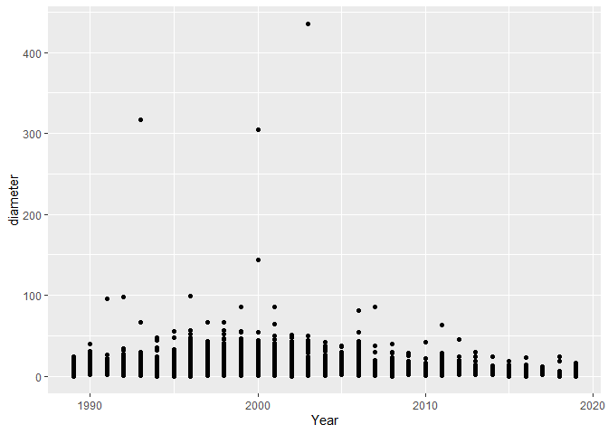
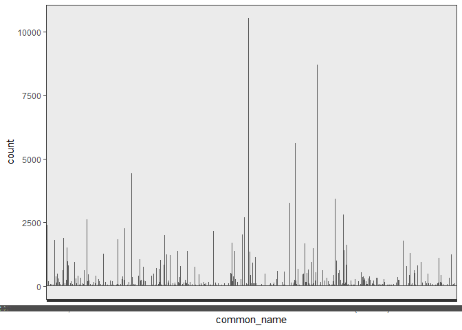
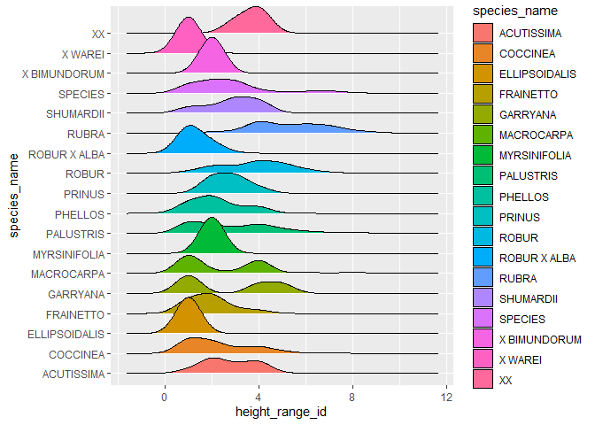
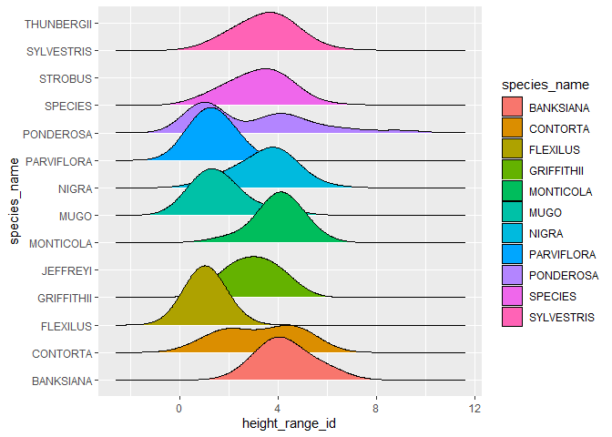
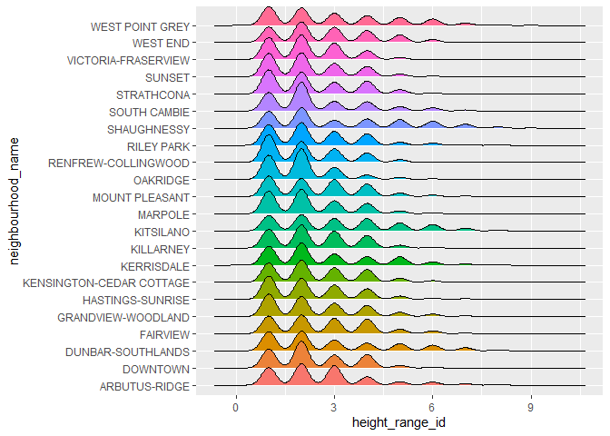
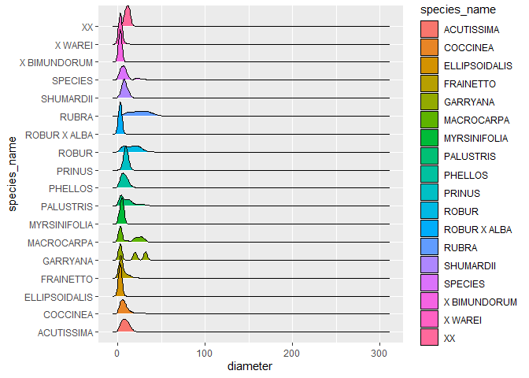
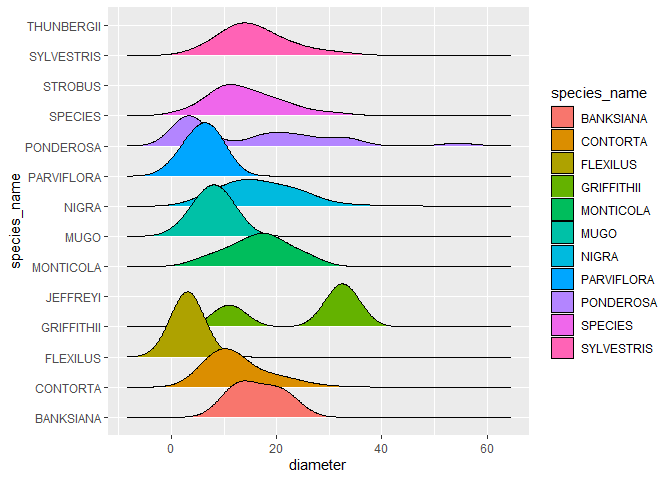
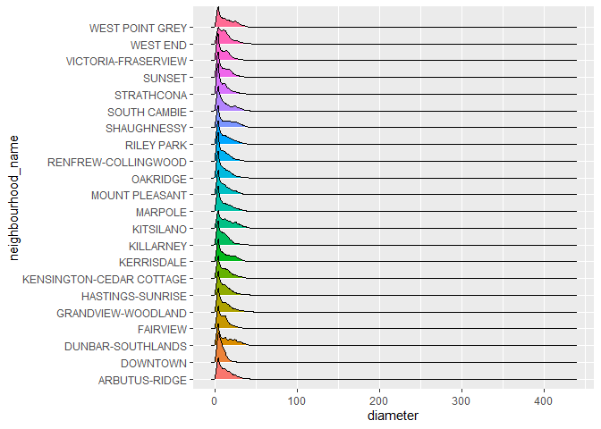
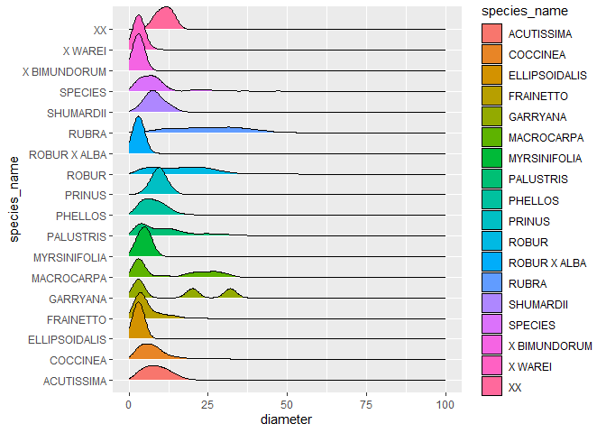
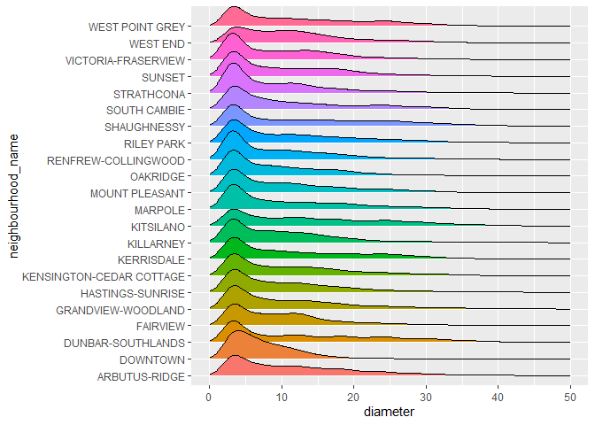

Mini Data Analysis 1
================

# 1 Choosing a data set

## 1.1

From reading the descriptions of the various datasets included in the
‘datateachr’ package, these 4 data sets are of most interest to me:

1.vancouver\_trees 2.flow\_sample 3.parking\_meters 4.building\_permits

## 1.2 exploring attributes of data

``` r
head(vancouver_trees)
```

    ## # A tibble: 6 x 20
    ##   tree_id civic_number std_street genus_name species_name cultivar_name  
    ##     <dbl>        <dbl> <chr>      <chr>      <chr>        <chr>          
    ## 1  149556          494 W 58TH AV  ULMUS      AMERICANA    BRANDON        
    ## 2  149563          450 W 58TH AV  ZELKOVA    SERRATA      <NA>           
    ## 3  149579         4994 WINDSOR ST STYRAX     JAPONICA     <NA>           
    ## 4  149590          858 E 39TH AV  FRAXINUS   AMERICANA    AUTUMN APPLAUSE
    ## 5  149604         5032 WINDSOR ST ACER       CAMPESTRE    <NA>           
    ## 6  149616          585 W 61ST AV  PYRUS      CALLERYANA   CHANTICLEER    
    ## # ... with 14 more variables: common_name <chr>, assigned <chr>,
    ## #   root_barrier <chr>, plant_area <chr>, on_street_block <dbl>,
    ## #   on_street <chr>, neighbourhood_name <chr>, street_side_name <chr>,
    ## #   height_range_id <dbl>, diameter <dbl>, curb <chr>, date_planted <date>,
    ## #   longitude <dbl>, latitude <dbl>

``` r
glimpse(vancouver_trees)
```

    ## Rows: 146,611
    ## Columns: 20
    ## $ tree_id            <dbl> 149556, 149563, 149579, 149590, 149604, 149616, 149~
    ## $ civic_number       <dbl> 494, 450, 4994, 858, 5032, 585, 4909, 4925, 4969, 7~
    ## $ std_street         <chr> "W 58TH AV", "W 58TH AV", "WINDSOR ST", "E 39TH AV"~
    ## $ genus_name         <chr> "ULMUS", "ZELKOVA", "STYRAX", "FRAXINUS", "ACER", "~
    ## $ species_name       <chr> "AMERICANA", "SERRATA", "JAPONICA", "AMERICANA", "C~
    ## $ cultivar_name      <chr> "BRANDON", NA, NA, "AUTUMN APPLAUSE", NA, "CHANTICL~
    ## $ common_name        <chr> "BRANDON ELM", "JAPANESE ZELKOVA", "JAPANESE SNOWBE~
    ## $ assigned           <chr> "N", "N", "N", "Y", "N", "N", "N", "N", "N", "N", "~
    ## $ root_barrier       <chr> "N", "N", "N", "N", "N", "N", "N", "N", "N", "N", "~
    ## $ plant_area         <chr> "N", "N", "4", "4", "4", "B", "6", "6", "3", "3", "~
    ## $ on_street_block    <dbl> 400, 400, 4900, 800, 5000, 500, 4900, 4900, 4900, 7~
    ## $ on_street          <chr> "W 58TH AV", "W 58TH AV", "WINDSOR ST", "E 39TH AV"~
    ## $ neighbourhood_name <chr> "MARPOLE", "MARPOLE", "KENSINGTON-CEDAR COTTAGE", "~
    ## $ street_side_name   <chr> "EVEN", "EVEN", "EVEN", "EVEN", "EVEN", "ODD", "ODD~
    ## $ height_range_id    <dbl> 2, 4, 3, 4, 2, 2, 3, 3, 2, 2, 2, 5, 3, 2, 2, 2, 2, ~
    ## $ diameter           <dbl> 10.00, 10.00, 4.00, 18.00, 9.00, 5.00, 15.00, 14.00~
    ## $ curb               <chr> "N", "N", "Y", "Y", "Y", "Y", "Y", "Y", "Y", "Y", "~
    ## $ date_planted       <date> 1999-01-13, 1996-05-31, 1993-11-22, 1996-04-29, 19~
    ## $ longitude          <dbl> -123.1161, -123.1147, -123.0846, -123.0870, -123.08~
    ## $ latitude           <dbl> 49.21776, 49.21776, 49.23938, 49.23469, 49.23894, 4~

``` r
unique(vancouver_trees)
```

    ## # A tibble: 146,611 x 20
    ##    tree_id civic_number std_street    genus_name species_name cultivar_name  
    ##      <dbl>        <dbl> <chr>         <chr>      <chr>        <chr>          
    ##  1  149556          494 W 58TH AV     ULMUS      AMERICANA    BRANDON        
    ##  2  149563          450 W 58TH AV     ZELKOVA    SERRATA      <NA>           
    ##  3  149579         4994 WINDSOR ST    STYRAX     JAPONICA     <NA>           
    ##  4  149590          858 E 39TH AV     FRAXINUS   AMERICANA    AUTUMN APPLAUSE
    ##  5  149604         5032 WINDSOR ST    ACER       CAMPESTRE    <NA>           
    ##  6  149616          585 W 61ST AV     PYRUS      CALLERYANA   CHANTICLEER    
    ##  7  149617         4909 SHERBROOKE ST ACER       PLATANOIDES  COLUMNARE      
    ##  8  149618         4925 SHERBROOKE ST ACER       PLATANOIDES  COLUMNARE      
    ##  9  149619         4969 SHERBROOKE ST ACER       PLATANOIDES  COLUMNARE      
    ## 10  149625          720 E 39TH AV     FRAXINUS   AMERICANA    AUTUMN APPLAUSE
    ## # ... with 146,601 more rows, and 14 more variables: common_name <chr>,
    ## #   assigned <chr>, root_barrier <chr>, plant_area <chr>,
    ## #   on_street_block <dbl>, on_street <chr>, neighbourhood_name <chr>,
    ## #   street_side_name <chr>, height_range_id <dbl>, diameter <dbl>, curb <chr>,
    ## #   date_planted <date>, longitude <dbl>, latitude <dbl>

``` r
unique(vancouver_trees$neighbourhood_name)
```

    ##  [1] "MARPOLE"                  "KENSINGTON-CEDAR COTTAGE"
    ##  [3] "OAKRIDGE"                 "MOUNT PLEASANT"          
    ##  [5] "RENFREW-COLLINGWOOD"      "RILEY PARK"              
    ##  [7] "DOWNTOWN"                 "SUNSET"                  
    ##  [9] "ARBUTUS-RIDGE"            "GRANDVIEW-WOODLAND"      
    ## [11] "KITSILANO"                "WEST END"                
    ## [13] "SHAUGHNESSY"              "HASTINGS-SUNRISE"        
    ## [15] "KERRISDALE"               "WEST POINT GREY"         
    ## [17] "KILLARNEY"                "STRATHCONA"              
    ## [19] "FAIRVIEW"                 "VICTORIA-FRASERVIEW"     
    ## [21] "DUNBAR-SOUTHLANDS"        "SOUTH CAMBIE"

``` r
unique(vancouver_trees$genus_name)
```

    ##  [1] "ULMUS"               "ZELKOVA"             "STYRAX"             
    ##  [4] "FRAXINUS"            "ACER"                "PYRUS"              
    ##  [7] "TILIA"               "HIBISCUS"            "LIQUIDAMBAR"        
    ## [10] "PRUNUS"              "CARPINUS"            "QUERCUS"            
    ## [13] "CRATAEGUS"           "ROBINIA"             "PARROTIA"           
    ## [16] "CORNUS"              "MAGNOLIA"            "CATALPA"            
    ## [19] "FAGUS"               "GLEDITSIA"           "CHAMAECYPARIS"      
    ## [22] "SORBUS"              "POPULUS"             "CERCIDIPHYLLUM"     
    ## [25] "AESCULUS"            "THUJA"               "NOTHOFAGUS"         
    ## [28] "MALUS"               "PINUS"               "ABIES"              
    ## [31] "SALIX"               "GYMNOCLADUS"         "PLATANUS"           
    ## [34] "BETULA"              "LIRIODENDRON"        "PICEA"              
    ## [37] "JUGLANS"             "DAVIDIA"             "PSEUDOTSUGA"        
    ## [40] "ILEX"                "CEDRUS"              "TAXUS"              
    ## [43] "SYRINGA"             "SEQUOIADENDRON"      "CERCIS"             
    ## [46] "GINKGO"              "RHAMNUS"             "CELTIS"             
    ## [49] "AMELANCHIER"         "STEWARTIA"           "TSUGA"              
    ## [52] "METASEQUOIA"         "CASTANEA"            "ALNUS"              
    ## [55] "NYSSA"               "ARAUCARIA"           "LABURNUM"           
    ## [58] "VIBURNUM"            "SOPHORA"             "ARBUTUS"            
    ## [61] "PTEROCARYA"          "CORYLUS"             "KALOPANAX"          
    ## [64] "CLADRASTIS"          "CRYPTOMERIA"         "OSTRYIA"            
    ## [67] "EUCOMMIA"            "PTEROSTYRAX"         "CALOCEDRUS"         
    ## [70] "TAXODIUM"            "EUONYMUS"            "RHUS"               
    ## [73] "LARIX"               "TRACHYCARPUS"        "JUNIPERUS"          
    ## [76] "MANGLIETIA"          "MORUS"               "SEQUOIA"            
    ## [79] "MESPILUS"            "ARALIA"              "KOELREUTERIA"       
    ## [82] "FICUS"               "SCIADOPITYS"         "PHELLODENDON"       
    ## [85] "LAURUS"              "HIPPOPHAE"           "CHITALPA"           
    ## [88] "HALESIA"             "OXYDENDRUM"          "AILANTHUS"          
    ## [91] "PTELEA"              "PAULOWNIA"           "MICHELIA"           
    ## [94] "CUPRESSOCYPARIS   X" "EUCALYPTUS"          "CLERODENDRON"       
    ## [97] "ALBIZIA"

``` r
head(flow_sample)
```

    ## # A tibble: 6 x 7
    ##   station_id  year extreme_type month   day  flow sym  
    ##   <chr>      <dbl> <chr>        <dbl> <dbl> <dbl> <chr>
    ## 1 05BB001     1909 maximum          7     7   314 <NA> 
    ## 2 05BB001     1910 maximum          6    12   230 <NA> 
    ## 3 05BB001     1911 maximum          6    14   264 <NA> 
    ## 4 05BB001     1912 maximum          8    25   174 <NA> 
    ## 5 05BB001     1913 maximum          6    11   232 <NA> 
    ## 6 05BB001     1914 maximum          6    18   214 <NA>

``` r
glimpse(flow_sample)
```

    ## Rows: 218
    ## Columns: 7
    ## $ station_id   <chr> "05BB001", "05BB001", "05BB001", "05BB001", "05BB001", "0~
    ## $ year         <dbl> 1909, 1910, 1911, 1912, 1913, 1914, 1915, 1916, 1917, 191~
    ## $ extreme_type <chr> "maximum", "maximum", "maximum", "maximum", "maximum", "m~
    ## $ month        <dbl> 7, 6, 6, 8, 6, 6, 6, 6, 6, 6, 6, 7, 6, 6, 6, 7, 5, 7, 6, ~
    ## $ day          <dbl> 7, 12, 14, 25, 11, 18, 27, 20, 17, 15, 22, 3, 9, 5, 14, 5~
    ## $ flow         <dbl> 314, 230, 264, 174, 232, 214, 236, 309, 174, 345, 185, 24~
    ## $ sym          <chr> NA, NA, NA, NA, NA, NA, NA, NA, NA, NA, NA, NA, NA, NA, N~

``` r
head(parking_meters)
```

    ## # A tibble: 6 x 22
    ##   meter_head  r_mf_9a_6p r_mf_6p_10 r_sa_9a_6p r_sa_6p_10 r_su_9a_6p r_su_6p_10
    ##   <chr>       <chr>      <chr>      <chr>      <chr>      <chr>      <chr>     
    ## 1 Twin        $2.00      $4.00      $2.00      $4.00      $2.00      $4.00     
    ## 2 Pay Station $1.00      $1.00      $1.00      $1.00      $1.00      $1.00     
    ## 3 Twin        $1.00      $1.00      $1.00      $1.00      $1.00      $1.00     
    ## 4 Single      $1.00      $1.00      $1.00      $1.00      $1.00      $1.00     
    ## 5 Twin        $2.00      $1.00      $2.00      $1.00      $2.00      $1.00     
    ## 6 Twin        $2.00      $1.00      $2.00      $1.00      $2.00      $1.00     
    ## # ... with 15 more variables: rate_misc <chr>, time_in_effect <chr>,
    ## #   t_mf_9a_6p <chr>, t_mf_6p_10 <chr>, t_sa_9a_6p <chr>, t_sa_6p_10 <chr>,
    ## #   t_su_9a_6p <chr>, t_su_6p_10 <chr>, time_misc <chr>, credit_card <chr>,
    ## #   pay_phone <chr>, longitude <dbl>, latitude <dbl>, geo_local_area <chr>,
    ## #   meter_id <chr>

``` r
head(building_permits)
```

    ## # A tibble: 6 x 14
    ##   permit_number issue_date project_value type_of_work  address  project_descrip~
    ##   <chr>         <date>             <dbl> <chr>         <chr>    <chr>           
    ## 1 BP-2016-02248 2017-02-01             0 Salvage and ~ 4378 W ~ <NA>            
    ## 2 BU468090      2017-02-01             0 New Building  1111 RI~ <NA>            
    ## 3 DB-2016-04450 2017-02-01         35000 Addition / A~ 3732 W ~ <NA>            
    ## 4 DB-2017-00131 2017-02-01         15000 Addition / A~ 88 W PE~ <NA>            
    ## 5 DB452250      2017-02-01        181178 New Building  492 E 6~ <NA>            
    ## 6 BP-2016-01458 2017-02-02             0 Salvage and ~ 3332 W ~ <NA>            
    ## # ... with 8 more variables: building_contractor <chr>,
    ## #   building_contractor_address <chr>, applicant <chr>,
    ## #   applicant_address <chr>, property_use <chr>, specific_use_category <chr>,
    ## #   year <dbl>, bi_id <dbl>

## 1.3

The two datasets that strike the most interest to me are
Vancouver\_trees and flow\_sample. vancouver\_trees provides a lot of
unique variables, including location which can allow for spatial
analysis. flow\_sample I find to be interesting since it’s including
extreme events and it has a time dimenstion.

## 1.4

Both of these data sets create various unique questions, but based on my
personal interests and background knowledge I find myself more
intreigued by the vancouver\_trees dataset. WIth this dataset, there’s a
lot of opportunities to explore a wide variety of atributes such as
location and tree species in the Vancouver metro area.

# 2 Exploring the dataset

## 2.1

``` r
#Creating a new variable vancouver_trees dataset. Just want to extract the year portion of the date planted. 
vancouver_trees$year <- as.Date(vancouver_trees$date_planted, format = "%Y-%m-%d")
vancouver_trees$Year <- as.numeric(format(vancouver_trees$year, '%Y'))
head(vancouver_trees)
```

    ## # A tibble: 6 x 22
    ##   tree_id civic_number std_street genus_name species_name cultivar_name  
    ##     <dbl>        <dbl> <chr>      <chr>      <chr>        <chr>          
    ## 1  149556          494 W 58TH AV  ULMUS      AMERICANA    BRANDON        
    ## 2  149563          450 W 58TH AV  ZELKOVA    SERRATA      <NA>           
    ## 3  149579         4994 WINDSOR ST STYRAX     JAPONICA     <NA>           
    ## 4  149590          858 E 39TH AV  FRAXINUS   AMERICANA    AUTUMN APPLAUSE
    ## 5  149604         5032 WINDSOR ST ACER       CAMPESTRE    <NA>           
    ## 6  149616          585 W 61ST AV  PYRUS      CALLERYANA   CHANTICLEER    
    ## # ... with 16 more variables: common_name <chr>, assigned <chr>,
    ## #   root_barrier <chr>, plant_area <chr>, on_street_block <dbl>,
    ## #   on_street <chr>, neighbourhood_name <chr>, street_side_name <chr>,
    ## #   height_range_id <dbl>, diameter <dbl>, curb <chr>, date_planted <date>,
    ## #   longitude <dbl>, latitude <dbl>, year <date>, Year <dbl>

``` r
#This is the only way how I got it to work since I didn't want to alter the original date planted column so what I want to do now is delete the "year" column! And while I'm at it I'll rename the dataset to be a more simple name.
Trees <-subset(vancouver_trees, select = -c(year))

#Now that I got the date as a year, I want to see the relationship between year and tree diameter. I'll use a scatterplot to best view the relationship.
ggplot(vancouver_trees, aes(x=Year, y=diameter)) +
  geom_point()
```

    ## Warning: Removed 76548 rows containing missing values (geom_point).

<!-- -->

## 2.2

``` r
# looking to see the number of trees for each species, creating a frequency plot based on tree species
# This plot shows that there is a fairly consistent count between species, however, there are a couple potential outliers to keep in mind depending on future analysis
Trees %>% 
  ggplot(aes(common_name)) +
  geom_bar() +
  theme_bw()
```

<!-- -->

## 2.3

``` r
#Instead of looking at all tree species in this dataset, I decided to filter the dataset and look more directly at a specific genus that's included. I chose to do this based off the high number of individual species making any single analysis task difficult and there are most likely different patterns between species so any analysis may POTENTIALLY be inconclusisve. 
#Used unique() command to see all possible genus names in the dataset

unique(Trees$genus_name)
```

    ##  [1] "ULMUS"               "ZELKOVA"             "STYRAX"             
    ##  [4] "FRAXINUS"            "ACER"                "PYRUS"              
    ##  [7] "TILIA"               "HIBISCUS"            "LIQUIDAMBAR"        
    ## [10] "PRUNUS"              "CARPINUS"            "QUERCUS"            
    ## [13] "CRATAEGUS"           "ROBINIA"             "PARROTIA"           
    ## [16] "CORNUS"              "MAGNOLIA"            "CATALPA"            
    ## [19] "FAGUS"               "GLEDITSIA"           "CHAMAECYPARIS"      
    ## [22] "SORBUS"              "POPULUS"             "CERCIDIPHYLLUM"     
    ## [25] "AESCULUS"            "THUJA"               "NOTHOFAGUS"         
    ## [28] "MALUS"               "PINUS"               "ABIES"              
    ## [31] "SALIX"               "GYMNOCLADUS"         "PLATANUS"           
    ## [34] "BETULA"              "LIRIODENDRON"        "PICEA"              
    ## [37] "JUGLANS"             "DAVIDIA"             "PSEUDOTSUGA"        
    ## [40] "ILEX"                "CEDRUS"              "TAXUS"              
    ## [43] "SYRINGA"             "SEQUOIADENDRON"      "CERCIS"             
    ## [46] "GINKGO"              "RHAMNUS"             "CELTIS"             
    ## [49] "AMELANCHIER"         "STEWARTIA"           "TSUGA"              
    ## [52] "METASEQUOIA"         "CASTANEA"            "ALNUS"              
    ## [55] "NYSSA"               "ARAUCARIA"           "LABURNUM"           
    ## [58] "VIBURNUM"            "SOPHORA"             "ARBUTUS"            
    ## [61] "PTEROCARYA"          "CORYLUS"             "KALOPANAX"          
    ## [64] "CLADRASTIS"          "CRYPTOMERIA"         "OSTRYIA"            
    ## [67] "EUCOMMIA"            "PTEROSTYRAX"         "CALOCEDRUS"         
    ## [70] "TAXODIUM"            "EUONYMUS"            "RHUS"               
    ## [73] "LARIX"               "TRACHYCARPUS"        "JUNIPERUS"          
    ## [76] "MANGLIETIA"          "MORUS"               "SEQUOIA"            
    ## [79] "MESPILUS"            "ARALIA"              "KOELREUTERIA"       
    ## [82] "FICUS"               "SCIADOPITYS"         "PHELLODENDON"       
    ## [85] "LAURUS"              "HIPPOPHAE"           "CHITALPA"           
    ## [88] "HALESIA"             "OXYDENDRUM"          "AILANTHUS"          
    ## [91] "PTELEA"              "PAULOWNIA"           "MICHELIA"           
    ## [94] "CUPRESSOCYPARIS   X" "EUCALYPTUS"          "CLERODENDRON"       
    ## [97] "ALBIZIA"

``` r
#recognize a few genus names such as fagus(beech), tsuga(select conifers) and others. Used website ontariotrees.com/main/list_genus.php to further research what species may be contained in each genus.
#going to create 2 new datasets. One will contain the genus quercus and the other will be pinus This will simplify analysis later on and Create the opportunity for comparison between evergreens (pinus entails pine trees) and deciduous species (as quercus genus are oak trees)

quercusgenus <- Trees %>% filter(genus_name=="QUERCUS")
pinusgenus <- Trees %>% filter(genus_name == "PINUS")
print(quercusgenus)
```

    ## # A tibble: 6,119 x 21
    ##    tree_id civic_number std_street   genus_name species_name cultivar_name
    ##      <dbl>        <dbl> <chr>        <chr>      <chr>        <chr>        
    ##  1  155306         6510 INVERNESS ST QUERCUS    ACUTISSIMA   <NA>         
    ##  2  155309         6626 INVERNESS ST QUERCUS    ACUTISSIMA   <NA>         
    ##  3  156222         2688 VINE ST      QUERCUS    ROBUR        <NA>         
    ##  4  156285          118 GARDEN DRIVE QUERCUS    ROBUR        SKYROCKET    
    ##  5  156287          120 GARDEN DRIVE QUERCUS    ROBUR        SKYROCKET    
    ##  6  156294          115 GARDEN DRIVE QUERCUS    ROBUR        SKYROCKET    
    ##  7  156422         2212 E 44TH AV    QUERCUS    ACUTISSIMA   <NA>         
    ##  8  156425         2268 E 44TH AV    QUERCUS    ACUTISSIMA   <NA>         
    ##  9  156436         2277 E 44TH AV    QUERCUS    ACUTISSIMA   <NA>         
    ## 10  156442         2126 E 44TH AV    QUERCUS    ACUTISSIMA   <NA>         
    ## # ... with 6,109 more rows, and 15 more variables: common_name <chr>,
    ## #   assigned <chr>, root_barrier <chr>, plant_area <chr>,
    ## #   on_street_block <dbl>, on_street <chr>, neighbourhood_name <chr>,
    ## #   street_side_name <chr>, height_range_id <dbl>, diameter <dbl>, curb <chr>,
    ## #   date_planted <date>, longitude <dbl>, latitude <dbl>, Year <dbl>

``` r
print(pinusgenus)
```

    ## # A tibble: 747 x 21
    ##    tree_id civic_number std_street       genus_name species_name cultivar_name
    ##      <dbl>        <dbl> <chr>            <chr>      <chr>        <chr>        
    ##  1  157412          430 DUNLEVY AV       PINUS      SYLVESTRIS   <NA>         
    ##  2  157413          430 DUNLEVY AV       PINUS      SYLVESTRIS   <NA>         
    ##  3  160131         1100 CHARLESON        PINUS      SPECIES      <NA>         
    ##  4  162418         3902 W KING EDWARD AV PINUS      NIGRA        <NA>         
    ##  5  162502         5505 OAK ST           PINUS      SYLVESTRIS   <NA>         
    ##  6  208886         3001 BOUNDARY ROAD    PINUS      NIGRA        <NA>         
    ##  7  221985         6172 COLLINGWOOD ST   PINUS      SPECIES      <NA>         
    ##  8   11977          768 PRIOR ST         PINUS      CONTORTA     <NA>         
    ##  9   12471          768 PRIOR ST         PINUS      CONTORTA     <NA>         
    ## 10   12575          762 PRIOR ST         PINUS      CONTORTA     <NA>         
    ## # ... with 737 more rows, and 15 more variables: common_name <chr>,
    ## #   assigned <chr>, root_barrier <chr>, plant_area <chr>,
    ## #   on_street_block <dbl>, on_street <chr>, neighbourhood_name <chr>,
    ## #   street_side_name <chr>, height_range_id <dbl>, diameter <dbl>, curb <chr>,
    ## #   date_planted <date>, longitude <dbl>, latitude <dbl>, Year <dbl>

## 2.4

``` r
# Want to compare a specific trait between each species of tree in the Quercus and Pinus genus. Chose to compare height range since it is one of only 2 numerical variables specific to physical attributes of the trees. Diameter being the second. 
# Ridge plot seemed to be the most practical!

ggplot(quercusgenus, aes(height_range_id, species_name)) +
  ggridges::geom_density_ridges(aes(fill = species_name))
```

    ## Picking joint bandwidth of 0.545

<!-- -->

``` r
ggplot(pinusgenus, aes(height_range_id, species_name)) +
  ggridges::geom_density_ridges(aes(fill = species_name))
```

    ## Picking joint bandwidth of 0.858

<!-- -->

``` r
# Just to explore height differences of trees between neighborhoods 
ggplot(Trees, aes(height_range_id, neighbourhood_name)) +
  ggridges::geom_density_ridges(aes(fill = neighbourhood_name)) +
  theme(legend.position = "none")
```

    ## Picking joint bandwidth of 0.214

<!-- -->

``` r
# Repeated what was done previously, but wanted to see relationship with diameter instead of height. Since height_range_id broken up into heigh classes and not a direct measurement of height, technically the height used in this dataset is categorical. 
ggplot(quercusgenus, aes(diameter, species_name)) +
  ggridges::geom_density_ridges(aes(fill = species_name))
```

    ## Picking joint bandwidth of 1.93

<!-- -->

``` r
ggplot(pinusgenus, aes(diameter, species_name)) +
  ggridges::geom_density_ridges(aes(fill = species_name))
```

    ## Picking joint bandwidth of 3.27

<!-- -->

``` r
ggplot(Trees, aes(diameter, neighbourhood_name)) +
  ggridges::geom_density_ridges(aes(fill = neighbourhood_name)) +
  theme(legend.position = "none")
```

    ## Picking joint bandwidth of 1.36

<!-- -->

``` r
#one thing I noticed is there may be some ouliers present in the datasets and is why the scale on the X-axis is so large for what the majority of the data falls into for the quercus and neighbourhood plots. Decided to shrink x-axis scale to see the relationship better in the quercus and neighbourhood datasets.

ggplot(quercusgenus, aes(diameter, species_name)) +
  ggridges::geom_density_ridges(aes(fill = species_name)) +
  xlim(0,100)
```

    ## Picking joint bandwidth of 1.93

    ## Warning: Removed 1 rows containing non-finite values (stat_density_ridges).

<!-- -->

``` r
ggplot(Trees, aes(diameter, neighbourhood_name)) +
  ggridges::geom_density_ridges(aes(fill = neighbourhood_name)) +
  theme(legend.position = "none") +
  xlim(0, 50)
```

    ## Picking joint bandwidth of 1.33

    ## Warning: Removed 153 rows containing non-finite values (stat_density_ridges).

<!-- -->

``` r
#We can see how all the ridge plots for the tree daimeters for each neighbourhood are all right-skewed. This is expected because with such a variety of tree species present, there are going to be some that are much larger than the average tree. But It's right skewed becasue you cannot have a tree diameter lower that 0 but, theoretically, there is no upper limit.  
```

# 3 potential Research Questions

### 3.1

How does tree density vary in each neighbourhood?

### 3.2

Are there patterns to the distribution of genus is Vancouver’s
neighbourhoods?

### 3.3

Are there relationships, and are they different between genus, between
year planted and diameter of tree?

### 3.4

Are certain trees more likely to be found on specific streets in
Vancouver? Are there other random relationships such as taller trees
being located on odd or even side street names?
