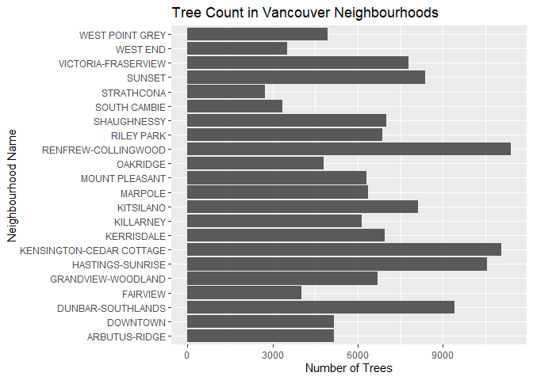
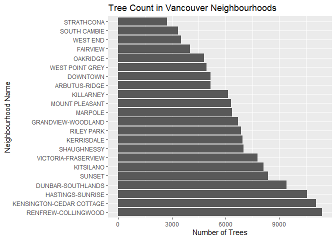
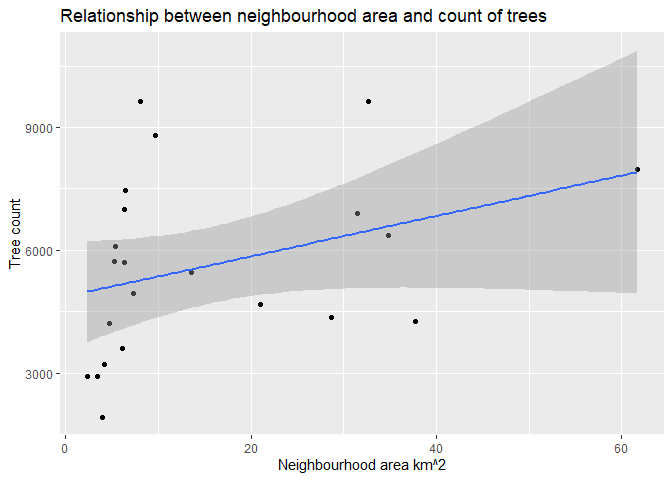

Mini Data Analysis 3
================

## Exercise 0: Datasets Made In Milestone 2

### Two research questions chosen:

*1. How does tree density vary in each neighbourhood?*

*2. Is there a relationship, if there is how strong is the correlation,
between tree diameter and height class?*

``` r
#select all potential variables I may need to answer my questions in Milestone 3
vancouver_trees %>%
  select(genus_name,
         neighbourhood_name,
         height_range_id,
         diameter,
         longitude,
         latitude,
         ) %>%
  #Remove all NA values present 
  na.omit() -> vantreeM3
```

### Data for question 1

``` r
# for question 1 I just want to select all variables I will need as I don't know the proper mutate() command to finish tidying my data set.
vantreeQ1 <- vantreeM3 %>%
  select(neighbourhood_name,
         longitude,
         latitude)

# Finding how many trees are present in each neighbourhood. Since every tree is attached to a neighbourgood I can just count each neighbourhood observation as a tree!
ntrees <- vantreeQ1 %>%
  group_by(neighbourhood_name) %>%
  count(neighbourhood_name)
#Won't combine with other data set due to them being different lengths, but us an organized wat to calculate counts!
```

### Data for question 2

``` r
#For question 4, want to remove diameter outliers since I noticed them earlier.
outliersM3 <- boxplot.stats(vantreeM3$diameter)$out

#also selecting the variables I will use in my analysis
vantreeQ2 <- vantreeM3 %>%
  select(height_range_id,
         diameter,
         genus_name #including just in case!
         ) %>% 
  filter(!diameter %in% outliersM3) #bye bye outliers
```

# Exercise 1: Special Data Types

## 1.1: Modifying Time

The dataset *vancouver\_trees* has a variable that includes the date for
which each tree was planted. For this exercise, I want to format and
modify the *date\_planted* variable to change the date to include just
the year component from the current Year-Month-Day format. I will use
the format() command to achieve this.

I included some code I used in Milestone 2 to extract the year from the
*date\_planted* variable. I wanted to just use the year for any analysis
or exploration of the data. This method I chose created new column
vectors *year* and *Year*. The method I used was cumbersome, although
using the format() command, but had uneccessary steps prior.

``` r
vancouver_trees$year <- as.Date(vancouver_trees$date_planted, format = "%Y-%m-%d")
vancouver_trees$Year <- as.numeric(format(vancouver_trees$year, '%Y'))
head(vancouver_trees)
```

    ## # A tibble: 6 x 22
    ##   tree_id civic_number std_street genus_name species_name cultivar_name  
    ##     <dbl>        <dbl> <chr>      <chr>      <chr>        <chr>          
    ## 1  149556          494 W 58TH AV  ULMUS      AMERICANA    BRANDON        
    ## 2  149563          450 W 58TH AV  ZELKOVA    SERRATA      <NA>           
    ## 3  149579         4994 WINDSOR ST STYRAX     JAPONICA     <NA>           
    ## 4  149590          858 E 39TH AV  FRAXINUS   AMERICANA    AUTUMN APPLAUSE
    ## 5  149604         5032 WINDSOR ST ACER       CAMPESTRE    <NA>           
    ## 6  149616          585 W 61ST AV  PYRUS      CALLERYANA   CHANTICLEER    
    ## # ... with 16 more variables: common_name <chr>, assigned <chr>,
    ## #   root_barrier <chr>, plant_area <chr>, on_street_block <dbl>,
    ## #   on_street <chr>, neighbourhood_name <chr>, street_side_name <chr>,
    ## #   height_range_id <dbl>, diameter <dbl>, curb <chr>, date_planted <date>,
    ## #   longitude <dbl>, latitude <dbl>, year <date>, Year <dbl>

When performing this modification to the data set, I don’t want to keep
the original Year-Month-Day column vector, which was not done in my
previous method. Using the mutaete() and format() commands, I can change
the *date\_planted* varaible to only contain the year component, while
not creating any new and unnecessary date variables.

``` r
#save as new dataset to ensure any changes I make are kept, but don't overwrite the original data set. 
van_tree_year <- vancouver_trees %>%
#remove the unnecessary variables created prior.
  subset( , -c(year, Year)) %>%
#format() function, paired with mutate(), to remove day and month attributes from the date_planted variable. 
  mutate(date_planted = format(date_planted, format = "%Y"))
head(van_tree_year)
```

    ## # A tibble: 6 x 20
    ##   tree_id civic_number std_street genus_name species_name cultivar_name  
    ##     <dbl>        <dbl> <chr>      <chr>      <chr>        <chr>          
    ## 1  149556          494 W 58TH AV  ULMUS      AMERICANA    BRANDON        
    ## 2  149563          450 W 58TH AV  ZELKOVA    SERRATA      <NA>           
    ## 3  149579         4994 WINDSOR ST STYRAX     JAPONICA     <NA>           
    ## 4  149590          858 E 39TH AV  FRAXINUS   AMERICANA    AUTUMN APPLAUSE
    ## 5  149604         5032 WINDSOR ST ACER       CAMPESTRE    <NA>           
    ## 6  149616          585 W 61ST AV  PYRUS      CALLERYANA   CHANTICLEER    
    ## # ... with 14 more variables: common_name <chr>, assigned <chr>,
    ## #   root_barrier <chr>, plant_area <chr>, on_street_block <dbl>,
    ## #   on_street <chr>, neighbourhood_name <chr>, street_side_name <chr>,
    ## #   height_range_id <dbl>, diameter <dbl>, curb <chr>, date_planted <chr>,
    ## #   longitude <dbl>, latitude <dbl>

Modifying the *date\_planted* coulmn allows for a better analysis to
address any potential research questions involving a timeline. There is
almost no measurable growth in trees between days so this information
isn’t very useful in most analysis. The year component allows for the
most diverse research questions when dealing with the age of trees. When
comparing age of trees with diameter or height, we can produce linear
regression models or covariance/correlation statistics, again, using
year as our time.

## 1.2: Reordering factors

To answer question 1, I will be taking a plot I made in Milestone 2,
which was plotting the count of trees per neighbourhood by using just
the variable *neighbourhood\_name.* Because every tree is attacthed to a
neighbourhood (except for a few circumstances), I was able to have the
Neighbourhood Name be my categorical variable and the count of each
neighbourhood name in the *Trees* dataset I created in Milestone 2 be
plotted for each of the neighbourhoods.

``` r
#have to import the old data set to create plots
vancouver_trees$year <- as.Date(vancouver_trees$date_planted, format = "%Y-%m-%d")
vancouver_trees$Year <- as.numeric(format(vancouver_trees$year, '%Y'))
head(vancouver_trees)
```

    ## # A tibble: 6 x 22
    ##   tree_id civic_number std_street genus_name species_name cultivar_name  
    ##     <dbl>        <dbl> <chr>      <chr>      <chr>        <chr>          
    ## 1  149556          494 W 58TH AV  ULMUS      AMERICANA    BRANDON        
    ## 2  149563          450 W 58TH AV  ZELKOVA    SERRATA      <NA>           
    ## 3  149579         4994 WINDSOR ST STYRAX     JAPONICA     <NA>           
    ## 4  149590          858 E 39TH AV  FRAXINUS   AMERICANA    AUTUMN APPLAUSE
    ## 5  149604         5032 WINDSOR ST ACER       CAMPESTRE    <NA>           
    ## 6  149616          585 W 61ST AV  PYRUS      CALLERYANA   CHANTICLEER    
    ## # ... with 16 more variables: common_name <chr>, assigned <chr>,
    ## #   root_barrier <chr>, plant_area <chr>, on_street_block <dbl>,
    ## #   on_street <chr>, neighbourhood_name <chr>, street_side_name <chr>,
    ## #   height_range_id <dbl>, diameter <dbl>, curb <chr>, date_planted <date>,
    ## #   longitude <dbl>, latitude <dbl>, year <date>, Year <dbl>

``` r
Trees <-subset(vancouver_trees, select = -c(year))
#Plotting the counts of trees in each neighbourhood. When finding the density of trees, we first need to know the count of how many observations are in each neighbourhood. Graphing helps us visualize the differences in neighbourhoods, but isn't conclusive (obviously) because we need to know the area of each neighbourhood. 
Trees %>%
  filter(!is.na(neighbourhood_name)) %>%
  ggplot() +
  geom_bar(aes(y = neighbourhood_name)) +
  ggtitle("Tree Count in Vancouver Neighbourhoods") +
  ylab("Neighbourhood Name") +
  xlab("Number of Trees")
```

<!-- -->

``` r
# Can use the plot command/outline as in previous but the reordering neighbourhood name variable. 
Trees %>%
  filter(!is.na(neighbourhood_name)) %>%
  mutate(neighbourhood_name = fct_infreq(neighbourhood_name)) %>% #added in this command to redorder neighbourhoods from least to greated based on tree count. 
  ggplot() +
  geom_bar(aes(y = neighbourhood_name)) +
  ggtitle("Tree Count in Vancouver Neighbourhoods") +
  ylab("Neighbourhood Name") +
  xlab("Number of Trees")
```

<!-- -->

By reordering the neighbourhoods by the number of trees present in each,
it’s now easier to identify which neighbourhodos have the highest tree
count, and therefore ones we may suspect to also have the largest
geographical area. What is easiest now to identify is the subtle
differences in each of the nieghbourhoods. Before reordering, it was
extremeely hard to tell if Kerrisdale had more ore less trees planted
that Shaughnessy, but after the reorder, we can definitively see that
Kerrisdale has fewer.

# Exercise 2: Modelling

### Research question: How does tree density vary in each neighbourhood?

### Variable of interest: Tree density

Before I begin my analysis, The way I’m calculating area for each
neighbourhood is very rudamental and not accurate in the slightest. The
geographical boundaries defining each neighbourhood are not rectangular,
but for my research, I will be pretending that they are so all I need is
to calculate are longitude and a latitdue lengths in km.

## 2.1 Hypothesis testing

For exercise 2, I will be running a hypothesis test on tree density per
neighbourhood. I will be altering the latitude and longitude variables
to calculate the area in \(km^2\) (extremely rough estimate) of each
neighbourhood.

``` r
vantree1 <- vantreeQ1 %>%
  #want to find latitude and longitude characteristics for each neighbourhood 
  group_by(neighbourhood_name) %>%
  #max and min dimensions of the length and width of neighbourhoods
  mutate(
    MaxLong = max(longitude),
    MinLong = min(longitude),
    MaxLat = max(latitude),
    MinLat = min(latitude)
  ) %>%
  #removing variables that are not needed anymore
  subset( , -c(longitude, latitude)) %>%
  #removing all repeat rows so we have one for each neighbourhood
  unique()

head(vantree1)
```

    ## # A tibble: 6 x 5
    ## # Groups:   neighbourhood_name [6]
    ##   neighbourhood_name       MaxLong MinLong MaxLat MinLat
    ##   <chr>                      <dbl>   <dbl>  <dbl>  <dbl>
    ## 1 MARPOLE                    -123.   -123.   49.2   49.2
    ## 2 KENSINGTON-CEDAR COTTAGE   -123.   -123.   49.3   49.2
    ## 3 OAKRIDGE                   -123.   -123.   49.2   49.2
    ## 4 MOUNT PLEASANT             -123.   -123.   49.3   49.2
    ## 5 RENFREW-COLLINGWOOD        -123.   -123.   49.3   49.2
    ## 6 RILEY PARK                 -123.   -123.   49.3   49.2

``` r
#new dataset with final calculations and variables of interst. 
vantree1_final <- merge(vantree1, ntrees, by ="neighbourhood_name") %>%
  mutate(
    Longdiff = (MaxLong-MinLong),
    Latdiff = (MaxLat-MinLat),
    #converting distances measured in degrees into km. Have to use cosine function for longitude coordinates since it depends on which latitude you are at on the globe. Becasue of very small variation in latitude for each neighbourhood, chose their minimum values to calculate the longitude distance in km. 
    Latkm = (110.574*Latdiff),
    Longkm = (Longdiff*(111.320*(cos(MinLat*(pi/180))))),
    Areakm = (Latkm*Longkm),
    Treedensity = (n/Areakm)
  ) %>%
  #slecting only variables I want
  select( , c("neighbourhood_name", "n", "Areakm", "Treedensity"))

head(vantree1_final)
```

    ##   neighbourhood_name    n    Areakm Treedensity
    ## 1      ARBUTUS-RIDGE 4264 37.740587    112.9818
    ## 2           DOWNTOWN 3613  6.124115    589.9628
    ## 3  DUNBAR-SOUTHLANDS 7982 61.646772    129.4796
    ## 4           FAIRVIEW 3207  4.137080    775.1844
    ## 5 GRANDVIEW-WOODLAND 5451 13.511332    403.4391
    ## 6   HASTINGS-SUNRISE 8817  9.691240    909.7907

What I will be testing is to see if there is an associaltion between
number of trees and the size of the neighbourhood. I will create a
linear regression model between the two variables and test to see how
significant of a relationship is present. What this analysis is telling
me is if depending on the size of the neighbourhood, can we accuretly
predict the number of trees?

``` r
#create slr model between number of trees and neighbourhood area
slr_density <- lm(n ~ Areakm, data = vantree1_final)

summary(slr_density)
```

    ## 
    ## Call:
    ## lm(formula = n ~ Areakm, data = vantree1_final)
    ## 
    ## Residuals:
    ##     Min      1Q  Median      3Q     Max 
    ## -3137.7 -1785.0  -145.6   870.8  4373.2 
    ## 
    ## Coefficients:
    ##             Estimate Std. Error t value Pr(>|t|)    
    ## (Intercept)  4864.90     636.89   7.638 2.36e-07 ***
    ## Areakm         49.34      29.25   1.687    0.107    
    ## ---
    ## Signif. codes:  0 '***' 0.001 '**' 0.01 '*' 0.05 '.' 0.1 ' ' 1
    ## 
    ## Residual standard error: 2100 on 20 degrees of freedom
    ## Multiple R-squared:  0.1245, Adjusted R-squared:  0.08078 
    ## F-statistic: 2.845 on 1 and 20 DF,  p-value: 0.1072

``` r
#plotting the data with regression model for visualization
vantree1_final %>%
  ggplot(aes(Areakm, n)) +
  geom_point()+
  #adding regression line with confidence interval using geom_smooth
  geom_smooth(method = "lm") +
  ggtitle("Relationship between neighbourhood area and count of trees") +
  xlab("Neighbourhood area km^2") +
  ylab("Tree count")
```

    ## `geom_smooth()` using formula 'y ~ x'

<!-- -->

## 2.2 Conclusions

``` r
summary(slr_density)
```

    ## 
    ## Call:
    ## lm(formula = n ~ Areakm, data = vantree1_final)
    ## 
    ## Residuals:
    ##     Min      1Q  Median      3Q     Max 
    ## -3137.7 -1785.0  -145.6   870.8  4373.2 
    ## 
    ## Coefficients:
    ##             Estimate Std. Error t value Pr(>|t|)    
    ## (Intercept)  4864.90     636.89   7.638 2.36e-07 ***
    ## Areakm         49.34      29.25   1.687    0.107    
    ## ---
    ## Signif. codes:  0 '***' 0.001 '**' 0.01 '*' 0.05 '.' 0.1 ' ' 1
    ## 
    ## Residual standard error: 2100 on 20 degrees of freedom
    ## Multiple R-squared:  0.1245, Adjusted R-squared:  0.08078 
    ## F-statistic: 2.845 on 1 and 20 DF,  p-value: 0.1072

Using the summary statistics from our fitted regression model, the slope
coefficient \(\beta_1\) is estimated at 49.34. Meaning, with every
square kilometer increase in neighbourhood size, the tree count is
expected to increase by approximately 49 trees. This model, however, has
a \(R^2\) value \~ 0.1, meaning there is little correlation between the
two variables. The p-value may be 0.1, meaning the fitted regression
model has slight significance, but we need to look at the \(R^2\) value,
p-value of \(\beta_1\) and the scatter plot to see that the relationship
between tree count and neighbourhood size isn’t strong. However, I’m
sure if I was able to accurately measure neighbourhood size with the
given data set, the relationship may be present\!

# Exercise 3: Reading and Writing Data

## 3.1

I will be taking the *Trees* data set I made in Milestone 2 and making
it into a .csv file.

``` r
#create output folder in directory
dir.create(here::here("output"))
```

    ## Warning in dir.create(here::here("output")): 'C:
    ## \Users\marco\OneDrive\Desktop\STAT 545A\Marc-Wettengel-Mini-Analysis\output'
    ## already exists

``` r
#create name for export file. Send it to output folder
write_csv(Trees, here::here("output", "M3_Trees.csv"))
```

## 3.2

Using my slr model produced and saving it as a .rds file.

``` r
rds_file <- here::here("output", "M3_slr.rds")
saveRDS(slr_density, file=rds_file)
readRDS(rds_file)
```

    ## 
    ## Call:
    ## lm(formula = n ~ Areakm, data = vantree1_final)
    ## 
    ## Coefficients:
    ## (Intercept)       Areakm  
    ##     4864.90        49.34
