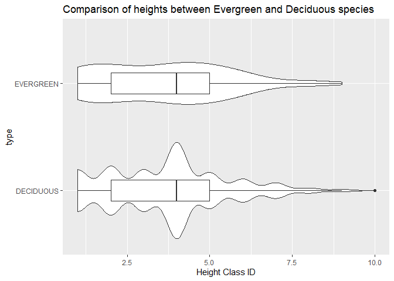
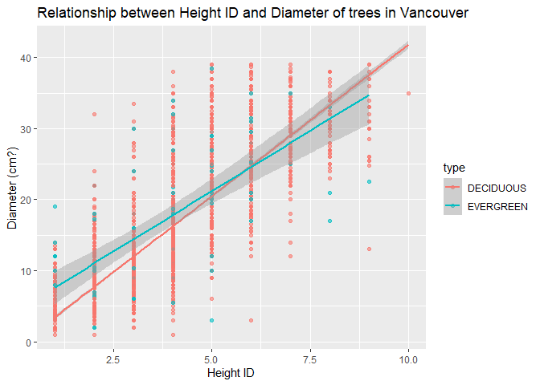

Mini Data Analysis 2
================

# Task 1: Process and sumarize data

## 1.1 - Research questions from milestone 1

### 1\. How does tree density vary in each neighbourhood?

### 2\. Are there patterns to the height class of evergreens vs. deciduous species in Vancouver?

### 3\. How does the number of trees planted change over time, and are there differences between genus or neighborhood?

### 4\. Is there a relationship, if there is how strong is the correlation, between tree diameter and height class?

## 1.2 - Summarizing data for each research question

**Summarizing**

1.  Compute the range, mean, and two other summary statistics of one
    numerical variable across the groups of one categorical variable
    from your data.
2.  Compute the number of observations for at least one of your
    categorical variables. Do not use the function table()\!
3.  Create a categorical variable with 3 or more groups from an existing
    numerical variable. You can use this new variable in the other
    tasks\! An example: age in years into “child, teen, adult, senior”.
4.  Based on two categorical variables, calculate two summary statistics
    of your choosing.

**Graphing**

5.  Create a graph out of summarized variables that has at least two
    geom layers.
6.  Create a graph of your choosing, make one of the axes logarithmic,
    and format the axes labels so that they are “pretty” or easier to
    read.
7.  Make a graph where it makes sense to customize the alpha
    transparency.
8.  Create 3 histograms out of summarized variables, with each histogram
    having different sized bins. Pick the “best” one and explain why it
    is the best.

<!-- end list -->

``` r
#Want to begin by creating a column with just year (removing the month and day aspect to the date_planted variable)
vancouver_trees$year <- as.Date(vancouver_trees$date_planted, format = "%Y-%m-%d")
vancouver_trees$Year <- as.numeric(format(vancouver_trees$year, '%Y'))
head(vancouver_trees)
```

    ## # A tibble: 6 x 22
    ##   tree_id civic_number std_street genus_name species_name cultivar_name  
    ##     <dbl>        <dbl> <chr>      <chr>      <chr>        <chr>          
    ## 1  149556          494 W 58TH AV  ULMUS      AMERICANA    BRANDON        
    ## 2  149563          450 W 58TH AV  ZELKOVA    SERRATA      <NA>           
    ## 3  149579         4994 WINDSOR ST STYRAX     JAPONICA     <NA>           
    ## 4  149590          858 E 39TH AV  FRAXINUS   AMERICANA    AUTUMN APPLAUSE
    ## 5  149604         5032 WINDSOR ST ACER       CAMPESTRE    <NA>           
    ## 6  149616          585 W 61ST AV  PYRUS      CALLERYANA   CHANTICLEER    
    ## # ... with 16 more variables: common_name <chr>, assigned <chr>,
    ## #   root_barrier <chr>, plant_area <chr>, on_street_block <dbl>,
    ## #   on_street <chr>, neighbourhood_name <chr>, street_side_name <chr>,
    ## #   height_range_id <dbl>, diameter <dbl>, curb <chr>, date_planted <date>,
    ## #   longitude <dbl>, latitude <dbl>, year <date>, Year <dbl>

``` r
Trees <-subset(vancouver_trees, select = -c(year))
head(Trees)
```

    ## # A tibble: 6 x 21
    ##   tree_id civic_number std_street genus_name species_name cultivar_name  
    ##     <dbl>        <dbl> <chr>      <chr>      <chr>        <chr>          
    ## 1  149556          494 W 58TH AV  ULMUS      AMERICANA    BRANDON        
    ## 2  149563          450 W 58TH AV  ZELKOVA    SERRATA      <NA>           
    ## 3  149579         4994 WINDSOR ST STYRAX     JAPONICA     <NA>           
    ## 4  149590          858 E 39TH AV  FRAXINUS   AMERICANA    AUTUMN APPLAUSE
    ## 5  149604         5032 WINDSOR ST ACER       CAMPESTRE    <NA>           
    ## 6  149616          585 W 61ST AV  PYRUS      CALLERYANA   CHANTICLEER    
    ## # ... with 15 more variables: common_name <chr>, assigned <chr>,
    ## #   root_barrier <chr>, plant_area <chr>, on_street_block <dbl>,
    ## #   on_street <chr>, neighbourhood_name <chr>, street_side_name <chr>,
    ## #   height_range_id <dbl>, diameter <dbl>, curb <chr>, date_planted <date>,
    ## #   longitude <dbl>, latitude <dbl>, Year <dbl>

### 1.2.1 Research Question 1

**Question** How does tree density vary in each neighbourhood?

**Summarizing** 2. Compute the number of observations for at least one
of your categorical variables. Do not use the function table()\!

``` r
#Because each tree is attached to a neighbourhood, we can just find the count of neighbourhoods in the tree data set and use that as the count of trees. BUT, we want to first remove all NA observations from the neighbourhood_name variable and then do the count!
Trees %>%
  filter(!is.na(neighbourhood_name)) %>%
  group_by(neighbourhood_name) %>%
  count(neighbourhood_name)
```

    ## # A tibble: 22 x 2
    ## # Groups:   neighbourhood_name [22]
    ##    neighbourhood_name           n
    ##    <chr>                    <int>
    ##  1 ARBUTUS-RIDGE             5169
    ##  2 DOWNTOWN                  5159
    ##  3 DUNBAR-SOUTHLANDS         9415
    ##  4 FAIRVIEW                  4002
    ##  5 GRANDVIEW-WOODLAND        6703
    ##  6 HASTINGS-SUNRISE         10547
    ##  7 KENSINGTON-CEDAR COTTAGE 11042
    ##  8 KERRISDALE                6936
    ##  9 KILLARNEY                 6148
    ## 10 KITSILANO                 8115
    ## # ... with 12 more rows

**Grpahing** 6. Create a graph of your choosing, make one of the axes
logarithmic, and format the axes labels so that they are “pretty” or
easier to read.

``` r
#Now wanting to plot the counts of trees in each neighbourhood. When finding the density of trees, we first need to know the count of how many observations in each neighbourhood. Graphing helps us visualize the differences in neighbourhoods, but isn't conclusive (obviously) because we need to know the area of each neighbourhood. 
Trees %>%
  filter(!is.na(neighbourhood_name)) %>%
  ggplot() +
  geom_bar(aes(y = neighbourhood_name)) +
  ggtitle("Tree Count in Vancouver Neighbourhoods") +
  ylab("Neighbourhood Name") +
  xlab("Number of Trees")
```

<!-- -->

### 1.2.2 Research Question 2

**Question** Are there patterns to the height class of evergreens
vs. deciduous species in Vancouver?

**Summarizing** 1. Compute the range, mean, and two other summary
statistics of one numerical variable across the groups of one
categorical variable from your data.

``` r
# Due to the vast number of species of trees, I'm going to randomly select 5 genus's of deciduous and 5 genus's of evergreen species to compare.
deciduous <- Trees %>% filter(genus_name == c("QUERCUS", "ULMUS", "CORNUS", "KOELREUTERIA", "TILIA"))
```

    ## Warning in genus_name == c("QUERCUS", "ULMUS", "CORNUS", "KOELREUTERIA", :
    ## longer object length is not a multiple of shorter object length

``` r
evergreen <- Trees %>% filter(genus_name == c("PICEA", "PINUS", "PSEUDOTSUGA", "CEDRUS", "SEQUOIADENDRON"))
```

    ## Warning in genus_name == c("PICEA", "PINUS", "PSEUDOTSUGA", "CEDRUS",
    ## "SEQUOIADENDRON"): longer object length is not a multiple of shorter object
    ## length

``` r
unique(deciduous$genus_name)
```

    ## [1] "ULMUS"        "TILIA"        "QUERCUS"      "CORNUS"       "KOELREUTERIA"

``` r
unique(evergreen$genus_name)
```

    ## [1] "PINUS"          "PSEUDOTSUGA"    "CEDRUS"         "SEQUOIADENDRON"
    ## [5] "PICEA"

``` r
evded <- rbind(deciduous, evergreen)
head(evded)
```

    ## # A tibble: 6 x 21
    ##   tree_id civic_number std_street      genus_name species_name cultivar_name
    ##     <dbl>        <dbl> <chr>           <chr>      <chr>        <chr>        
    ## 1  155413         2485 W BROADWAY      ULMUS      AMERICANA    BRANDON      
    ## 2  155577         3034 E KENT AV SOUTH TILIA      EUCHLORA   X <NA>         
    ## 3  156425         2268 E 44TH AV       QUERCUS    ACUTISSIMA   <NA>         
    ## 4  157359         1497 E 33RD AV       QUERCUS    ROBUR        SKYMASTER    
    ## 5  158100         1225 SEYMOUR ST      TILIA      CORDATA      <NA>         
    ## 6  158450         1221 W CORDOVA ST    QUERCUS    COCCINEA     <NA>         
    ## # ... with 15 more variables: common_name <chr>, assigned <chr>,
    ## #   root_barrier <chr>, plant_area <chr>, on_street_block <dbl>,
    ## #   on_street <chr>, neighbourhood_name <chr>, street_side_name <chr>,
    ## #   height_range_id <dbl>, diameter <dbl>, curb <chr>, date_planted <date>,
    ## #   longitude <dbl>, latitude <dbl>, Year <dbl>

``` r
#Summary statistics for both the deciduous and evergreen species that were randomly selected. 
sumdec <- deciduous %>%
  filter(!is.na(height_range_id)) %>% #remove all NA values if there are any
  summarise(
    count = n(),
    mean = mean(height_range_id),
    median = median(height_range_id),#categorical data so not a very good measure
    min = min(height_range_id),
    max = max(height_range_id),
    sd = sd(height_range_id)
    )

sumev <- evergreen %>%
  filter(!is.na(height_range_id)) %>% #remove all NA values if there are any
  summarise(
    count = n(),
    mean = mean(height_range_id),
    median = median(height_range_id),
    min = min(height_range_id),
    max = max(height_range_id),
    sd = sd(height_range_id)
    )

sumevded <- rbind(sumdec, sumev)
head(sumevded)
```

    ## # A tibble: 2 x 6
    ##   count  mean median   min   max    sd
    ##   <int> <dbl>  <dbl> <dbl> <dbl> <dbl>
    ## 1  3609  3.66      4     1    10  1.79
    ## 2   501  3.78      4     1    10  1.90

**Grpahing**

``` r
#Want to create a new variable determining if the tree is an evergreen or a deciduous.
evded$type <- as.factor(ifelse(evded$genus_name == c("PINUS", "PICEA", "PSEUDOTSUGA", "CEDRUS", "SEQUOIADENDRON"), 'EVERGREEN','DECIDUOUS'))
head(evded)
```

    ## # A tibble: 6 x 22
    ##   tree_id civic_number std_street      genus_name species_name cultivar_name
    ##     <dbl>        <dbl> <chr>           <chr>      <chr>        <chr>        
    ## 1  155413         2485 W BROADWAY      ULMUS      AMERICANA    BRANDON      
    ## 2  155577         3034 E KENT AV SOUTH TILIA      EUCHLORA   X <NA>         
    ## 3  156425         2268 E 44TH AV       QUERCUS    ACUTISSIMA   <NA>         
    ## 4  157359         1497 E 33RD AV       QUERCUS    ROBUR        SKYMASTER    
    ## 5  158100         1225 SEYMOUR ST      TILIA      CORDATA      <NA>         
    ## 6  158450         1221 W CORDOVA ST    QUERCUS    COCCINEA     <NA>         
    ## # ... with 16 more variables: common_name <chr>, assigned <chr>,
    ## #   root_barrier <chr>, plant_area <chr>, on_street_block <dbl>,
    ## #   on_street <chr>, neighbourhood_name <chr>, street_side_name <chr>,
    ## #   height_range_id <dbl>, diameter <dbl>, curb <chr>, date_planted <date>,
    ## #   longitude <dbl>, latitude <dbl>, Year <dbl>, type <fct>

``` r
#side by side box plots between deciduous and evergreen species 
evded %>%
  filter(!is.na(height_range_id)) %>%
  filter(!is.na(type)) %>%
  ggplot(aes(x = height_range_id, y = type)) +
  geom_violin()+
  geom_boxplot(width = 0.2)
```

<!-- -->

### 1.2.3 Research Question 3

**Question** How does the number of trees planted change over time, and
are there differences between genus or neighborhood?

**Summarizing** 2/3. Compute the number of observations for at least one
of your categorical variables. Do not use the function table()\!
Additionally, create a categorical variable with 3 or more groups from
an existing numerical variable.

``` r
#finding out how many "old" trees there are.
evdednew <-evded %>% 
  filter(!is.na(height_range_id)) %>% 
  filter(!is.na(Year))
max(evded$Year)
```

    ## [1] NA

``` r
evdednew$age <- as.factor(ifelse(evdednew$Year < 2000, "90s",
                              ifelse(evdednew$Year < 2010, "00s",
                              ifelse(evdednew$Year < 2020, "10s"))))       

evdednew %>% 
  group_by(type) %>%
  summarise(sum_of_old = sum(age == "90s"))
```

    ## # A tibble: 2 x 2
    ##   type      sum_of_old
    ##   <fct>          <int>
    ## 1 DECIDUOUS        525
    ## 2 EVERGREEN          3

**Grpahing** 5. Create a graph out of summarized variables that has at
least two geom layers.

``` r
#Using the subset data "evdednew" for this plot since there are so many NA values in the evded dataset and is why we went from 4110 observations to just 1145. Because of the vast amount of data missing, I would not recommend any further analysis with this research question!


ggplot(evdednew, aes(x = Year)) +
  geom_bar(color = "black", aes(fill = age)) +
  ggtitle("Number of trees planted each year in Vancouver Neighbourhoods") +
  ylab("Count")
```

<!-- -->

### 1.2.4 Research Question 4

**Question** Is there a relationship, if there is how strong is the
correlation, between tree diameter and height class?

**Summarizing** 1. Compute the range, mean, and two other summary
statistics of one numerical variable across the groups of one
categorical variable from your data.

``` r
#this is not helpful but couldn't think of anything else to compute (that my skills allow)

#remove outliers
outliers <- boxplot.stats(evded$diameter)$out

evded %>% 
  filter(type == "EVERGREEN") %>%
  filter(!is.na(diameter)) %>% #remove all NA values if there are any
  filter(!diameter %in% outliers) %>% #No more outliers
  summarise(
    count = n(),
    mean = mean(diameter),
    median = median(diameter),#categorical data so not a very good measure
    min = min(diameter),
    max = max(diameter),
    sd = sd(diameter)
    )
```

    ## # A tibble: 1 x 6
    ##   count  mean median   min   max    sd
    ##   <int> <dbl>  <dbl> <dbl> <dbl> <dbl>
    ## 1    99  16.4     17     2  38.5  9.65

**Grpahing**

``` r
#creating a scatterplot to visualize the relationship between tree Diameter and the height class ID. 
evded %>%
  filter(!is.na(diameter)) %>%
  filter(!is.na(height_range_id)) %>%
  filter(!is.na(type)) %>%
  filter(!diameter %in% outliers) %>% #Filter out the outliers!
  ggplot(aes(height_range_id, diameter, color = type)) +
  geom_point(alpha = 0.6) + 
  ggtitle("Relationship between Height ID and Diameter of trees in Vancouver") +
  xlab("Height ID") +
  ylab("Diameter (cm?)")
```

<!-- -->

## 1.3

Here are the 4 research question I had initially:

1.  How does tree density vary in each neighbourhood?
2.  Are there patterns to the height class of evergreens vs. deciduous
    species in Vancouver?
3.  How does the number of trees planted change over time, and are there
    differences between genus or neighborhood?
4.  Is there a relationship, if there is how strong is the correlation,
    between tree diameter and height class?

Upon completing this milestone, I can eliminate one of my research
questions I had prior to completing this assignment. Question 3 can be
removed from my score because there are a lot of values in my subset of
the **vancouver\_trees** data set that did not contain a date planted.
After removing the observations without a year planted value, the length
of the data set was approximately one fourth of the original. With so
many observations lost, I cannot determine if there was a random
distribution of trees without dates or if there was some limitation
specific to a certain category of trees.

Research question 1 is most interesting to me, however, the challenge
will be finding the area for each neighbourhood in Vancouver. I have an
idea on how to complete this (however not accurate) but will be good a
exercise to further my skills in R and tidy data. Questions 1 and 4 are
yielding the most interesting results to me and both pose unique, but
intriguing challenges in my analysis project. I am much closer to
answering these questions, I just need to overcome an obstacle in each
anaylsis to yield a complete analysis.

# Tast 2: Tidy your data

## 2.1 Is my data Tidy?

A reminder of the definition of tidy data:

  - Each row is an **observation**
  - Each column is a **variable**
  - Each cell is a **value**

<!-- end list -->

``` r
#before determining if the data set is tidy, I will use the head() command to visualize my data set. 
head(vancouver_trees)
```

    ## # A tibble: 6 x 22
    ##   tree_id civic_number std_street genus_name species_name cultivar_name  
    ##     <dbl>        <dbl> <chr>      <chr>      <chr>        <chr>          
    ## 1  149556          494 W 58TH AV  ULMUS      AMERICANA    BRANDON        
    ## 2  149563          450 W 58TH AV  ZELKOVA    SERRATA      <NA>           
    ## 3  149579         4994 WINDSOR ST STYRAX     JAPONICA     <NA>           
    ## 4  149590          858 E 39TH AV  FRAXINUS   AMERICANA    AUTUMN APPLAUSE
    ## 5  149604         5032 WINDSOR ST ACER       CAMPESTRE    <NA>           
    ## 6  149616          585 W 61ST AV  PYRUS      CALLERYANA   CHANTICLEER    
    ## # ... with 16 more variables: common_name <chr>, assigned <chr>,
    ## #   root_barrier <chr>, plant_area <chr>, on_street_block <dbl>,
    ## #   on_street <chr>, neighbourhood_name <chr>, street_side_name <chr>,
    ## #   height_range_id <dbl>, diameter <dbl>, curb <chr>, date_planted <date>,
    ## #   longitude <dbl>, latitude <dbl>, year <date>, Year <dbl>

``` r
#There are more than 8 columns, so I will select the 8 that I will most frequently use to answer my 2 research questions.


vancouver_trees %>%
  select(genus_name,
         species_name,
         common_name,
         neighbourhood_name,
         height_range_id,
         diameter,
         date_planted,
         longitude,
         latitude,
         year
         ) %>%
  na.omit() -> Vancity_trees
head(Vancity_trees)
```

    ## # A tibble: 6 x 10
    ##   genus_name species_name common_name  neighbourhood_n~ height_range_id diameter
    ##   <chr>      <chr>        <chr>        <chr>                      <dbl>    <dbl>
    ## 1 ULMUS      AMERICANA    BRANDON ELM  MARPOLE                        2       10
    ## 2 ZELKOVA    SERRATA      JAPANESE ZE~ MARPOLE                        4       10
    ## 3 STYRAX     JAPONICA     JAPANESE SN~ KENSINGTON-CEDA~               3        4
    ## 4 FRAXINUS   AMERICANA    AUTUMN APPL~ KENSINGTON-CEDA~               4       18
    ## 5 ACER       CAMPESTRE    HEDGE MAPLE  KENSINGTON-CEDA~               2        9
    ## 6 ACER       PLATANOIDES  COLUMNAR NO~ KENSINGTON-CEDA~               3       15
    ## # ... with 4 more variables: date_planted <date>, longitude <dbl>,
    ## #   latitude <dbl>, year <date>

Now we can see if the dataset is tidy or not. We can answer the
questions posed to us earlier:

1.  Is each row an observation?

**It is very clear that each row of this data set is an observation as
each row is a unique tree in the city of Vancouver, indicated by the
unique tree ID number in the original dataset (I removed the variable
because it wouldn’t be useful in my analysis)**

2.  Is each column a variable?

**Each column represents a variable in this data set and each variable
is independent (meaning it has it’s own row) in the data set.**

3.  Is each cell a value?

**Each cell contains a value (depending on the varible it’s either
categorical or continious) for each observation present in the data set,
so this requirement for tidy data is met\!**

## 2.2 Untidy and retidy **Vancity\_trees**

``` r
untidyvancity <- Vancity_trees %>%
  pivot_wider(names_from = neighbourhood_name,
                values_from = height_range_id)
```

    ## Warning: Values are not uniquely identified; output will contain list-cols.
    ## * Use `values_fn = list` to suppress this warning.
    ## * Use `values_fn = length` to identify where the duplicates arise
    ## * Use `values_fn = {summary_fun}` to summarise duplicates

``` r
glimpse(untidyvancity)
```

    ## Rows: 58,732
    ## Columns: 30
    ## $ genus_name                 <chr> "ULMUS", "ZELKOVA", "STYRAX", "FRAXINUS", "~
    ## $ species_name               <chr> "AMERICANA", "SERRATA", "JAPONICA", "AMERIC~
    ## $ common_name                <chr> "BRANDON ELM", "JAPANESE ZELKOVA", "JAPANES~
    ## $ diameter                   <dbl> 10.00, 10.00, 4.00, 18.00, 9.00, 15.00, 14.~
    ## $ date_planted               <date> 1999-01-13, 1996-05-31, 1993-11-22, 1996-0~
    ## $ longitude                  <dbl> -123.1161, -123.1147, -123.0846, -123.0870,~
    ## $ latitude                   <dbl> 49.21776, 49.21776, 49.23938, 49.23469, 49.~
    ## $ year                       <date> 1999-01-13, 1996-05-31, 1993-11-22, 1996-0~
    ## $ MARPOLE                    <list> 2, 4, <NULL>, <NULL>, <NULL>, <NULL>, <NUL~
    ## $ `KENSINGTON-CEDAR COTTAGE` <list> <NULL>, <NULL>, 3, 4, 2, 3, 3, 2, 2, 2, 5,~
    ## $ OAKRIDGE                   <list> <NULL>, <NULL>, <NULL>, <NULL>, <NULL>, <N~
    ## $ `MOUNT PLEASANT`           <list> <NULL>, <NULL>, <NULL>, <NULL>, <NULL>, <N~
    ## $ `RENFREW-COLLINGWOOD`      <list> <NULL>, <NULL>, <NULL>, <NULL>, <NULL>, <N~
    ## $ SUNSET                     <list> <NULL>, <NULL>, <NULL>, <NULL>, <NULL>, <N~
    ## $ KITSILANO                  <list> <NULL>, <NULL>, <NULL>, <NULL>, <NULL>, <N~
    ## $ SHAUGHNESSY                <list> <NULL>, <NULL>, <NULL>, <NULL>, <NULL>, <N~
    ## $ `WEST END`                 <list> <NULL>, <NULL>, <NULL>, <NULL>, <NULL>, <N~
    ## $ KERRISDALE                 <list> <NULL>, <NULL>, <NULL>, <NULL>, <NULL>, <N~
    ## $ `WEST POINT GREY`          <list> <NULL>, <NULL>, <NULL>, <NULL>, <NULL>, <N~
    ## $ KILLARNEY                  <list> <NULL>, <NULL>, <NULL>, <NULL>, <NULL>, <N~
    ## $ `RILEY PARK`               <list> <NULL>, <NULL>, <NULL>, <NULL>, <NULL>, <N~
    ## $ STRATHCONA                 <list> <NULL>, <NULL>, <NULL>, <NULL>, <NULL>, <N~
    ## $ `HASTINGS-SUNRISE`         <list> <NULL>, <NULL>, <NULL>, <NULL>, <NULL>, <N~
    ## $ `ARBUTUS-RIDGE`            <list> <NULL>, <NULL>, <NULL>, <NULL>, <NULL>, <N~
    ## $ `GRANDVIEW-WOODLAND`       <list> <NULL>, <NULL>, <NULL>, <NULL>, <NULL>, <N~
    ## $ `VICTORIA-FRASERVIEW`      <list> <NULL>, <NULL>, <NULL>, <NULL>, <NULL>, <N~
    ## $ `DUNBAR-SOUTHLANDS`        <list> <NULL>, <NULL>, <NULL>, <NULL>, <NULL>, <N~
    ## $ FAIRVIEW                   <list> <NULL>, <NULL>, <NULL>, <NULL>, <NULL>, <N~
    ## $ DOWNTOWN                   <list> <NULL>, <NULL>, <NULL>, <NULL>, <NULL>, <N~
    ## $ `SOUTH CAMBIE`             <list> <NULL>, <NULL>, <NULL>, <NULL>, <NULL>, <N~

``` r
head(untidyvancity)
```

    ## # A tibble: 6 x 30
    ##   genus_name species_name common_name   diameter date_planted longitude latitude
    ##   <chr>      <chr>        <chr>            <dbl> <date>           <dbl>    <dbl>
    ## 1 ULMUS      AMERICANA    BRANDON ELM         10 1999-01-13       -123.     49.2
    ## 2 ZELKOVA    SERRATA      JAPANESE ZEL~       10 1996-05-31       -123.     49.2
    ## 3 STYRAX     JAPONICA     JAPANESE SNO~        4 1993-11-22       -123.     49.2
    ## 4 FRAXINUS   AMERICANA    AUTUMN APPLA~       18 1996-04-29       -123.     49.2
    ## 5 ACER       CAMPESTRE    HEDGE MAPLE          9 1993-12-17       -123.     49.2
    ## 6 ACER       PLATANOIDES  COLUMNAR NOR~       15 1993-12-16       -123.     49.2
    ## # ... with 23 more variables: year <date>, MARPOLE <list>,
    ## #   KENSINGTON-CEDAR COTTAGE <list>, OAKRIDGE <list>, MOUNT PLEASANT <list>,
    ## #   RENFREW-COLLINGWOOD <list>, SUNSET <list>, KITSILANO <list>,
    ## #   SHAUGHNESSY <list>, WEST END <list>, KERRISDALE <list>,
    ## #   WEST POINT GREY <list>, KILLARNEY <list>, RILEY PARK <list>,
    ## #   STRATHCONA <list>, HASTINGS-SUNRISE <list>, ARBUTUS-RIDGE <list>,
    ## #   GRANDVIEW-WOODLAND <list>, VICTORIA-FRASERVIEW <list>, ...

This data now looks untidy and most cell values don’t exist anymore\!
This data set is not optimal for my analysis and some values I need
aren’t included anymore from the original **vancouver\_trees** data
set.

``` r
#now we want to retidy the data set! 
tidyvancity <- untidyvancity %>%
  pivot_longer(cols = -c(genus_name:year),
               names_to = "neighbourhood_name",
               values_to = "height_range_id")
head(tidyvancity)
```

    ## # A tibble: 6 x 10
    ##   genus_name species_name common_name diameter date_planted longitude latitude
    ##   <chr>      <chr>        <chr>          <dbl> <date>           <dbl>    <dbl>
    ## 1 ULMUS      AMERICANA    BRANDON ELM       10 1999-01-13       -123.     49.2
    ## 2 ULMUS      AMERICANA    BRANDON ELM       10 1999-01-13       -123.     49.2
    ## 3 ULMUS      AMERICANA    BRANDON ELM       10 1999-01-13       -123.     49.2
    ## 4 ULMUS      AMERICANA    BRANDON ELM       10 1999-01-13       -123.     49.2
    ## 5 ULMUS      AMERICANA    BRANDON ELM       10 1999-01-13       -123.     49.2
    ## 6 ULMUS      AMERICANA    BRANDON ELM       10 1999-01-13       -123.     49.2
    ## # ... with 3 more variables: year <date>, neighbourhood_name <chr>,
    ## #   height_range_id <list>

``` r
glimpse(tidyvancity)
```

    ## Rows: 1,292,104
    ## Columns: 10
    ## $ genus_name         <chr> "ULMUS", "ULMUS", "ULMUS", "ULMUS", "ULMUS", "ULMUS~
    ## $ species_name       <chr> "AMERICANA", "AMERICANA", "AMERICANA", "AMERICANA",~
    ## $ common_name        <chr> "BRANDON ELM", "BRANDON ELM", "BRANDON ELM", "BRAND~
    ## $ diameter           <dbl> 10, 10, 10, 10, 10, 10, 10, 10, 10, 10, 10, 10, 10,~
    ## $ date_planted       <date> 1999-01-13, 1999-01-13, 1999-01-13, 1999-01-13, 19~
    ## $ longitude          <dbl> -123.1161, -123.1161, -123.1161, -123.1161, -123.11~
    ## $ latitude           <dbl> 49.21776, 49.21776, 49.21776, 49.21776, 49.21776, 4~
    ## $ year               <date> 1999-01-13, 1999-01-13, 1999-01-13, 1999-01-13, 19~
    ## $ neighbourhood_name <chr> "MARPOLE", "KENSINGTON-CEDAR COTTAGE", "OAKRIDGE", ~
    ## $ height_range_id    <list> 2, <NULL>, <NULL>, <NULL>, <NULL>, <NULL>, <NULL>,~

``` r
#YAY
```

## 2.3 Choose 2 research questions

The two research questions I will continue my analysis on are:

1.  How does tree density vary in each neighbourhood?

2.  Is there a relationship, if there is how strong is the correlation,
    between tree diameter and height class?

I chose both of these questions because partly I had to remove question
3 from my scope of interest due to the elimination of many observations
after tidyign the dataset. Beyond that, these two questions pose the
most unique challenges to me, and have attributes I enjoy about them.
I’ve only lived in Vancouver for a few months now and I noticed how
each neighbourhood has a different distribution of trees and species and
I want to see if those differences are also apparent in this data set.
Question 4 I want to analyze more because there are a lot of other
questions that can stem from a correlation and scatterplot of tree
diameter vs. height and so I want to further dive into this question.

### Data set to use in milestone 3

``` r
#select all potential variables I may need to answer my questions in Milestone 3
vancouver_trees %>%
  select(genus_name,
         neighbourhood_name,
         height_range_id,
         diameter,
         longitude,
         latitude,
         ) %>%
  #Remove all NA values present 
  na.omit() -> vantreeM3
head(vantreeM3)
```

    ## # A tibble: 6 x 6
    ##   genus_name neighbourhood_name      height_range_id diameter longitude latitude
    ##   <chr>      <chr>                             <dbl>    <dbl>     <dbl>    <dbl>
    ## 1 ULMUS      MARPOLE                               2       10     -123.     49.2
    ## 2 ZELKOVA    MARPOLE                               4       10     -123.     49.2
    ## 3 STYRAX     KENSINGTON-CEDAR COTTA~               3        4     -123.     49.2
    ## 4 FRAXINUS   KENSINGTON-CEDAR COTTA~               4       18     -123.     49.2
    ## 5 ACER       KENSINGTON-CEDAR COTTA~               2        9     -123.     49.2
    ## 6 PYRUS      MARPOLE                               2        5     -123.     49.2

### Data for question 1

``` r
# for question 1 I just want to select all variables I will need as I don't know the proper mutate() command to finish tidying my data set.
vantreeQ1 <- vantreeM3 %>%
  select(genus_name, #including genus name just in case!
         neighbourhood_name,
         longitude,
         latitude)

#to find how many trees are present in each neighbourhood. Since every tree is attached to a neighbourgood I can just count each neighbourhood observation as a tree!
ntrees <- vantreeQ1 %>%
  group_by(neighbourhood_name) %>%
  count(neighbourhood_name)
#Won't combine with other data set due to them being different lengths 
head(vantreeQ1)
```

    ## # A tibble: 6 x 4
    ##   genus_name neighbourhood_name       longitude latitude
    ##   <chr>      <chr>                        <dbl>    <dbl>
    ## 1 ULMUS      MARPOLE                      -123.     49.2
    ## 2 ZELKOVA    MARPOLE                      -123.     49.2
    ## 3 STYRAX     KENSINGTON-CEDAR COTTAGE     -123.     49.2
    ## 4 FRAXINUS   KENSINGTON-CEDAR COTTAGE     -123.     49.2
    ## 5 ACER       KENSINGTON-CEDAR COTTAGE     -123.     49.2
    ## 6 PYRUS      MARPOLE                      -123.     49.2

### Data for question 4

``` r
#For question 4, want to remove diameter outliers since I noticed them earlier.
outliersM3 <- boxplot.stats(vantreeM3$diameter)$out

vantreeQ4 <- vantreeM3 %>%
  select(height_range_id,
         diameter,
         genus_name #including just in case!
         ) %>% 
  filter(!diameter %in% outliersM3) #bye bye outliers
```
